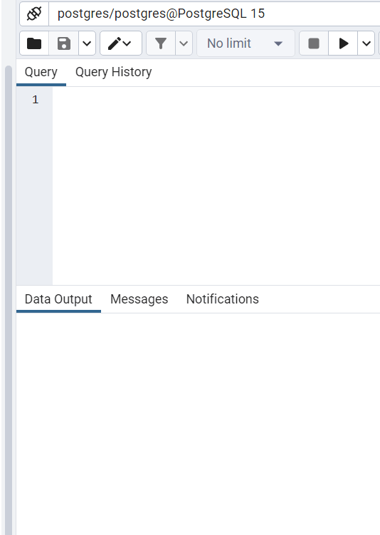

# dough-machine
postgresql-15.2-2-windows-x64.exe  
postgresql-42.6.0.jar

 

Dough Machine app is working with the PostgreSQL database. 
User can prepare a dough when all needed ingredients have enough amount. 
If amount of any ingredient is not enough a user gets information about it.
